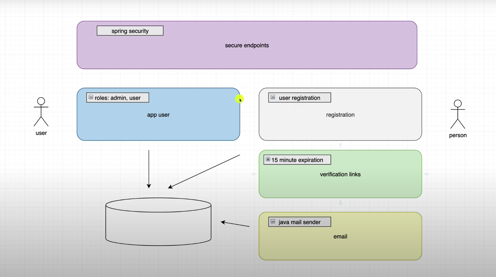
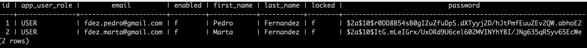
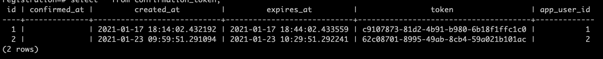

# Login and registration AmigosCode tutorial.
[Java Tutorial](https://www.youtube.com/watch?v=QwQuro7ekvc&t=2s)

## Architecture Diagram


## Spring Initializr
Project was bootstraped with Spring Initializr
[Spring Initializr](https://start.spring.io/)
####Dependencies used:
* Lombok [Developer Tools]
* Spring Web [WEB]
* Spring Security [SECURITY]
* PostgreSQL Driver [SQL]
* Spring Data JPA [SQL]
* Java Mail Sender [I/O]

## Database
To use this application create a database named **registration**.
As, an example, for postgres database:
```create database registration;```
This will match the information on the application.yml:
```
datasource:
    url: jdbc:postgresql://localhost:5432/registration
```

## Requests
To test this app, the following POST request can be sent:
```
{
    "firstName": "Name",
    "lastName": "Surname",
    "email": "name_surname@email.com",
    "password": "password"
}
```

And this will create the following entry on the DB


And token will be generated
